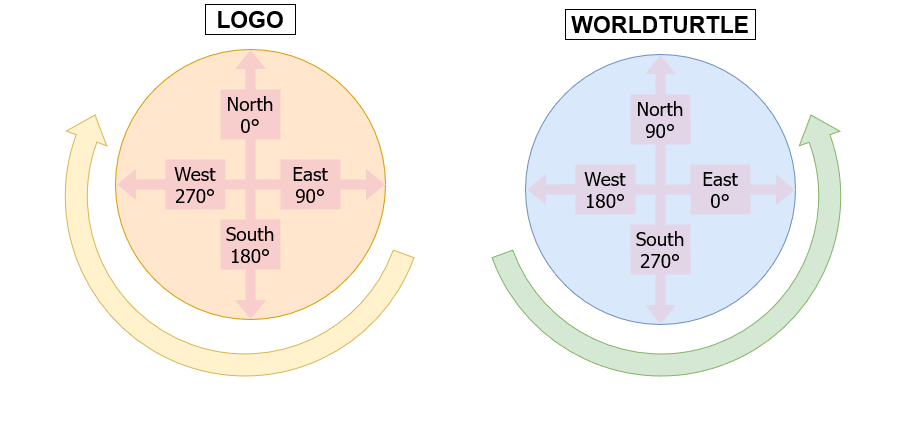

# Transcoding Logo to WorldTurtle

## Coordinate systems



WorldTurtle and LOGO have differing coordinate systems.

In LOGO, North is at 0°, and the heading increments clockwise.

In WorldTurtle, East is at 0°, and the heading increments counter-clockwise.

## Turtle Commands

| LOGO | `TurtleCommand`s |
-------|--------------------|
| `FORWARD X` (or `FD X`) | `forward X` (or `fd X`) |
| `BACK X` (or `BK X`) | `backward X` (or `bk X`) |
| `LEFT X` (or `LT X`) | `left X` (or `lt X`) |
| `RIGHT X` (or `RT X`) | `right X` (or `rt X`) |
| `PENDOWN` (or `PD`) | `setPenDown` |
| `PENUP` (or `PU`)| `setPenUp` |
| `SHOWTURTLE` (or `ST`) | `setVisible` |
| `HIDETURTLE` (or `ST`) | `setInvisible` |
| `SETPENSIZE [X Y]` | `setPenSize X` |
| `HOME` | `home` |
| `LABEL S` | `label S` |
| `WAIT x` | `wait X` |
| `SETXY X Y` | `goto (X, Y)` |
| `ARC A R` | `arc a r` |
| `SETX X` | `position >>= \(_, y) -> goto (X, y)` |
| `SETY Y` | `position >>= \(x, _) -> goto (x, Y)` |
| `POS` | `position` |
| `XCOR` | `fst <$> position` |
| `YCOR` | `snd <$> position` |
| `SETHEADING X` (or `SETH X`) | `setHeading X` |

### World Commands

| LOGO | `WorldCommand`s |
|-|-|
| `CLEARSCREEN` (or `CS`) | `clear` |
| `CLEARTEXT` | N/A |

## Repetition

### LOGO

In LOGO, repetition is done via lists such as:

```LOGO
REPEAT X [COMMAND1 COMMAND2 COMMAND3]
```

### WorldTurtle

In WorldTurtle, repetition is performed on one `TurtleCommand`, which can be composed of other 
commands using the `(>>)` operator.

```haskell
repeatFor X (command1 >> command2 >> command3)
```

You can also use do-notation to achieve the same effect:

```haskell
repeatFor X $ do 
    command1
    command2
    command3
```

## Procedures

### LOGO

In LOGO, procedures are written between `to`/`end` statements.

```LOGO
TO SQUARE
REPEAT 4 [FD 100 RT 90]
END
```

### WorldTurtle

In Haskell everything is a function; there is no special syntax for procedures. (But do remember that indentation is important!)

```haskell
square = repeatFor 4 $ fd 100 >> rt 90
```

In do-notation:

```haskell
square = do
    repeatFor 4 $ do
        fd 100
        rt 100
```

Note that in Haskell, types can be implicitly calculated by the compiler, it is good practice to 
write a type declaration:

```haskell
square :: TurtleCommand () 
square = repeatFor 4 $ fd 100 >> rt 90
```

## Arguments

Both LOGO and Haskell functions can take arguments which follow the declaration name.

### LOGO

```LOGO
TO SQUARE :n
REPEAT 4 [FD :n RT 90]
END
```

### WorldTurtle

```haskell
square :: Float -> TurtleCommand () 
square n = repeatFor 4 $ fd n >> rt 90
```