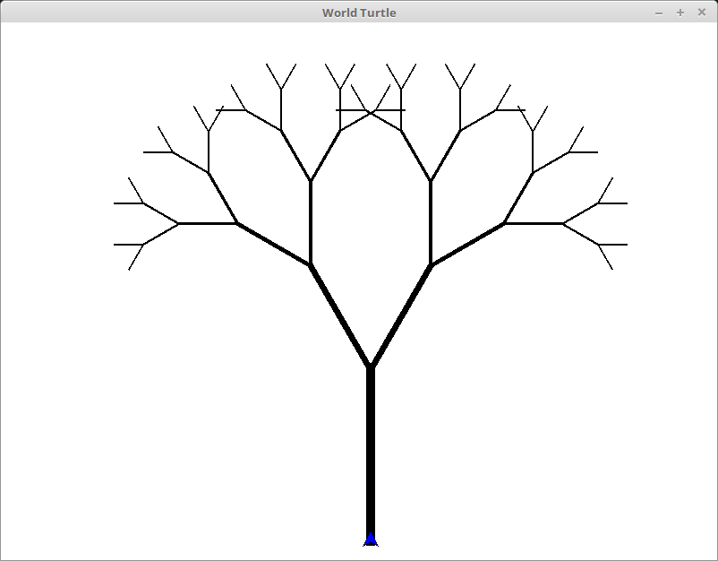

# WorldTurtle: Turtle Animations in Haskell

WorldTurtle is a Haskell take on [Turtle Graphics](https://en.wikipedia.org/wiki/Turtle_graphics).

The intent of this module is a teaching tool of Haskell principles and syntax
by using turtle commands to produce animations.

## Features

### Monadic commands

Turtle commands are monads!

The following snippet produces a square:

```haskell
module Main where

import Control.Monad (replicateM_) -- Required control flow functions.

import WorldTurtle

main :: IO ()
main = runTurtle $ do
  t <- makeTurtle
  replicateM_ 4 $ do
    forward 90 t
    right 90 t
```

Like so!
 

 
### Parallel animations

Use of the Alternative operator `(<|>)` allows monadic animations to run in
parallel as opposed to the default of in sequence.

## Examples

### Building and running examples

Examples can be built via [stack](https://docs.haskellstack.org/en/stable/README/).

```haskell
stack setup
stack build
```

After building, examples in the `worldturtle-examples` folder can then be
executed from stack. To run `parallelcircles` try:

```haskell
stack exec parallel-circles-exe
```

### List of current examples

| Example | Output |
|---------|--------|
| [square](worldturtle-examples/square/Main.hs) |  |
| [spiralstar](worldturtle-examples/spiralstar/Main.hs) | |
| [star](worldturtle-examples/star/Main.hs) |  |
| [parallelcircles](worldturtle-examples/parallelcircles/Main.hs) |  |
| [branch](worldturtle-examples/branch/Main.hs) |  |

## Future work (TODO)

- [ ] Improve the docs as much as possible.
- [ ] Animations.
- [ ] Start the main goal: Tutorial series!
- [ ] Fix the space leaks that are probably in there.
- [ ] Stack templates.
- [ ] Get this baby onto hackage.
