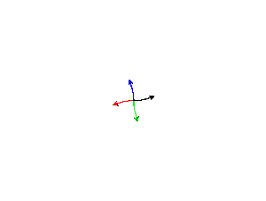
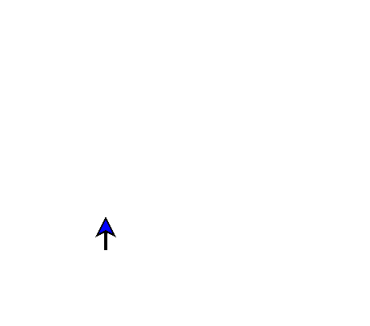
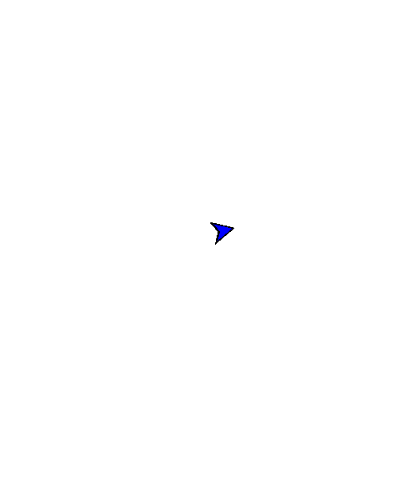

# WorldTurtle: Turtle Animations in Haskell



[WorldTurtle](https://hackage.haskell.org/package/worldturtle) is a Haskell take
on [Turtle Graphics](https://en.wikipedia.org/wiki/Turtle_graphics).

The intent of this module is a teaching tool by using turtle commands to
produce animations.

## Features

### Monadic commands

Turtle commands are monads!

The following snippet produces a square:

```haskell
import Control.Monad (replicateM_)
import Graphics.WorldTurtle

main :: IO ()
main = runTurtle $
  replicateM_ 4 $ do
    forward 90
    right 90
```

Like so!


 
### Parallel animations

Use of the Alternative operator `(<|>)` allows animations to run in
parallel. The
  [parallel/serial comparison](worldturtle-examples/parallelserialcomparison/Main.hs)
example shows that when given this code:

```haskell
import Graphics.WorldTurtle

main :: IO ()
main = runWorld $ do
  turtle1 <- makeTurtle' (0, 0) north green
  turtle2 <- makeTurtle' (0, 0) north red

  -- Draw the anticlockwise and clockwise circles in sequence. 
  (turtle1 >/> circle 90) >> (turtle2 >/> circle (-90))
  
  clear

  -- Draw the anticlockwise and clockwise circles in parallel.
  (turtle1 >/> circle 90) <|> (turtle2 >/> circle (-90))
```

We get this animation:


### Interactive Controls

You can interact with the animation window in the following ways:

| Action                                  | Interaction        |
|-----------------------------------------|--------------------|
| Pan the viewport.                       | Click and drag     |
| Zoom in/out.                            | Mousewheel up/down |
| Reset the viewport to initial position. | Spacebar           |
| Reset the animation.                    | `R` key            |
| Pause the animation.                    | `P` key            |
| Quit                                    | Escape key         |

## Examples

For all examples, look [here](worldturtle-examples)!

Here's some of my favorites:

### [spiralstar](worldturtle-examples/spiralstar/Main.hs) example

<p align="center">

</p>

### [spiralsquare](worldturtle-examples/spiralsquare/Main.hs) example

<p align="center">
 
</p>

### [lsystem](worldturtle-examples/lsystem/Main.hs) example

<p align="center">

</p>

## Building a project

### Prerequisites

To build this project you need `stack` and `ghc`. If you don't
already have these, then you can install them easily from the
[Haskell Platform](https://www.haskell.org/platform/)!

#### Windows

If you get this error on startup:

> user error (unknown GLUT entry glutInit)

Then this means you need the `freeglut MSVC` binaries which you can get
[here](https://www.transmissionzero.co.uk/software/freeglut-devel/).

Extract `freeglut\bin\x64\freeglut.dll` to the same location as the executable
you wish to run, or place it in a folder that can be discovered by your `%PATH%` variable.
([Here are some steps](https://docs.alfresco.com/4.2/tasks/fot-addpath.html) on how to add a new folder to your `%PATH%`.)

### Making a new turtle project from a template

Using stack, you can create your own `worldturtle` project by using the provided
template.

To create and run your own project, use the following commands to get setup:

```sh
stack new my-new-project FortOyer/worldturtle
cd my-new-project
stack build
stack exec my-new-project
```

## Building and running examples

Examples can be built via [stack](https://docs.haskellstack.org/en/stable/README/).

```sh
stack setup
stack build
```

After building, examples in the `worldturtle-examples` folder can then be
executed from stack. To run `parallelcircles` try:

```sh
stack exec parallelcircles-exe
```
