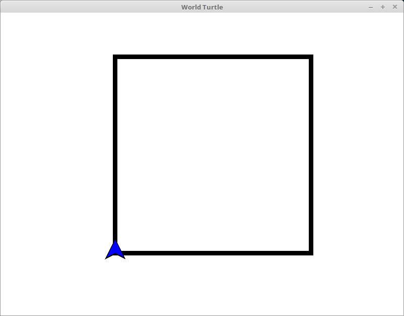
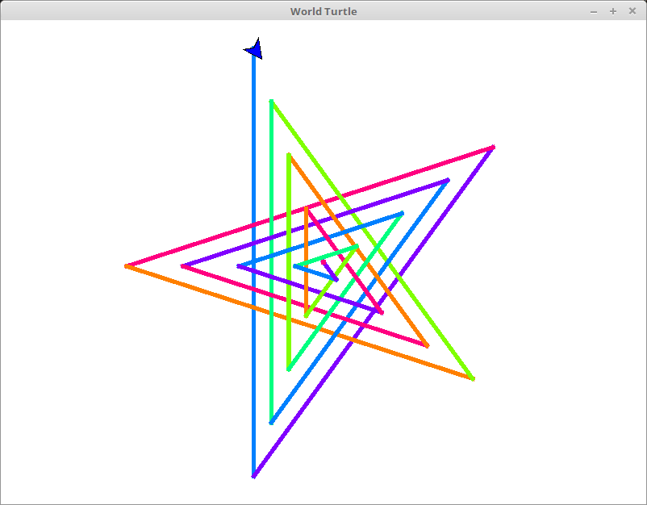
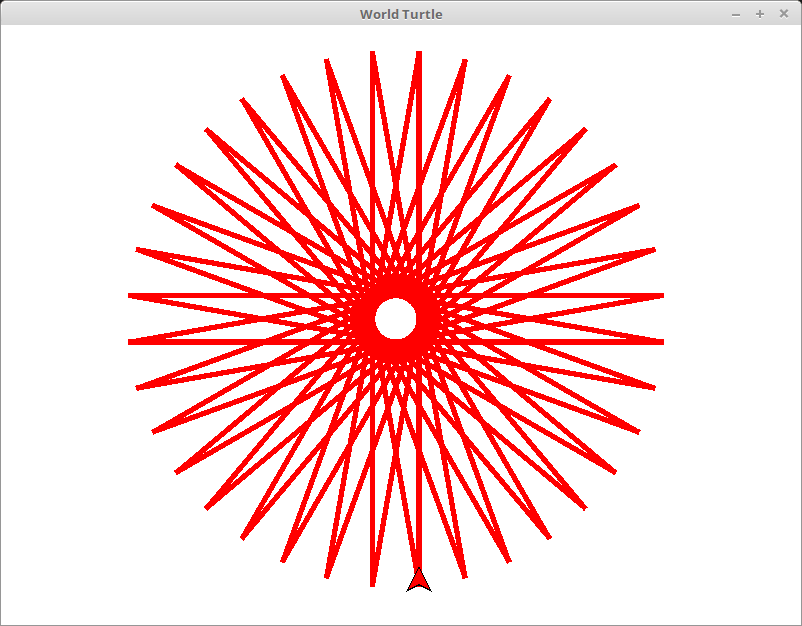
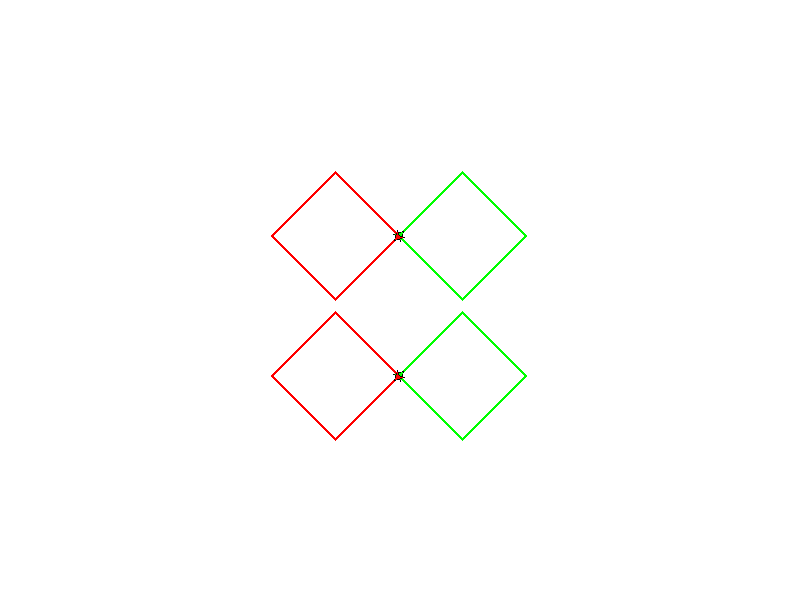
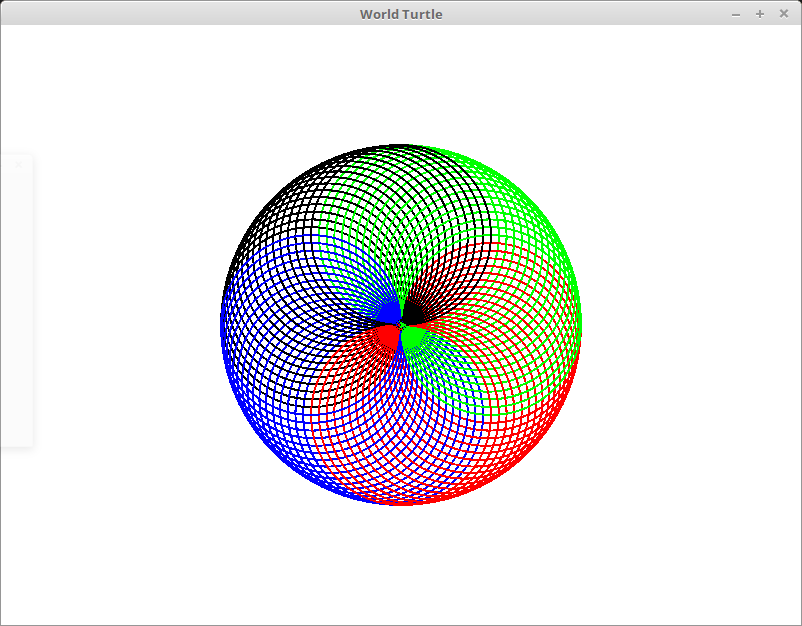
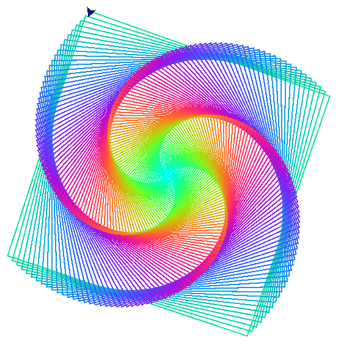
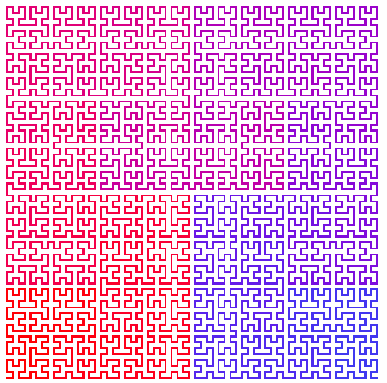
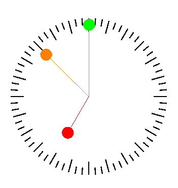
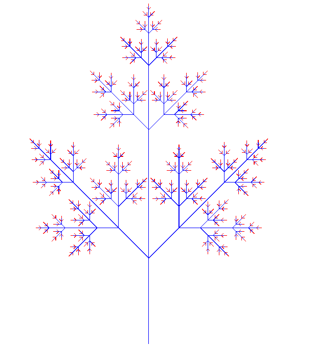

# WorldTurtle: Turtle Animations in Haskell


WorldTurtle is a Haskell take on [Turtle Graphics](https://en.wikipedia.org/wiki/Turtle_graphics).

The intent of this module is a teaching tool by using turtle commands to
produce animations.

## Features

### Monadic commands

Turtle commands are monads!

The following snippet produces a square:

```haskell
module Main where

import Control.Monad (replicateM_) -- Required control flow functions.

import Graphics.WorldTurtle

main :: IO ()
main = runTurtle $
  replicateM_ 4 $ do
    forward 90
    right 90
```

Like so!
 

 
### Parallel animations

Use of the Alternative operator `(<|>)` allows animations to run in
parallel as opposed to the default of in sequence. Here the [parallel/serial comparison](worldturtle-examples/parallelserialcomparison/Main.hs) example shows a combination of sequenced and parallel animations.


## Examples

| Example | Output |
|---------|--------|
| [square](worldturtle-examples/square/Main.hs) |  |
| [spiralstar](worldturtle-examples/spiralstar/Main.hs) | |
| [star](worldturtle-examples/star/Main.hs) |  |
| [parallelserialcomparison](worldturtle-examples/parallelserialcomparison/Main.hs) |  |
| [parallelcircles](worldturtle-examples/parallelcircles/Main.hs) |  |
| [tree](worldturtle-examples/tree/Main.hs) |  |
| [spiralsquare](worldturtle-examples/spiralsquare/Main.hs) |  |
| [hilbert](worldturtle-examples/hilbert/Main.hs) |  |
| [clock](worldturtle-examples/clock/Main.hs) |  |
| [lsystem](worldturtle-examples/lsystem/Main.hs) |  |

## Interactive Controls

| Action                                   | Interaction       |
|------------------------------------------|-------------------|
| Pan the viewport.                        | Click and drag    |
| Zoom in/out.                             |Mousewheel up/down |
| Reset the viewport to initial position.  | Spacebar          |
| Reset the animation.                     | `R` key           |
| Pause the animation.                     | `P` key           |
| Quit                                     | Escape key        |

## Prerequisites

To build this project you need `stack` and `ghc`. If you don't
already have these, then you can install them easily from the
[Haskell Platform](https://www.haskell.org/platform/)!

### Windows

If you get this error on startup:

> user error (unknown GLUT entry glutInit)

Then this means you need the `freeglut MSVC` binaries which you can get
[here](https://www.transmissionzero.co.uk/software/freeglut-devel/).

Extract `freeglut\bin\x64\freeglut.dll` to the same location as the executable
you wish to run, or place it in a folder that can be discovered by your `%PATH%` variable.
([Here are some steps](https://docs.alfresco.com/4.2/tasks/fot-addpath.html) on how to add a new folder to your `%PATH%`.)

## Building

### Building and running examples

Examples can be built via [stack](https://docs.haskellstack.org/en/stable/README/).

```sh
stack setup
stack build
```

After building, examples in the `worldturtle-examples` folder can then be
executed from stack. To run `parallelcircles` try:

```sh
stack exec parallelcircles-exe
```

### Making a new turtle template project

Using stack, you can create your own `worldturtle` project by using the provided
template.

To create and run your own project, use the following commands to get setup:

```sh
stack new my-new-project FortOyer/worldturtle
cd my-new-project
stack build
stack exec my-new-project
```
