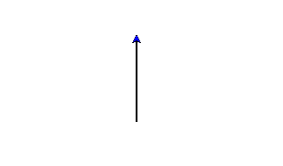

########################################
Setting up for a new WorldTurtle project
########################################

*************************
Downloading prerequisites
*************************

.. note::

  If you are already familiar with setting up your machine to run Haskell you 
  can skip this section!

For this tutorial series you will need a GHC compiler and the Stack build tool.

GHC is the Haskell compiler. GHC takes your Haskell code and converts it into
machine code your computer can understand.

Stack is a build-tool. It has many features, but we use Stack to help us 
simplify the process of setting up new projects.

I recommend following the instructions for the `Haskell Platform`_. This 
installs GHC, Stack, and other bits-and-bobs that are helpful when working in 
Haskell.

Alternatively, you can always download `Stack`_ directly! (You don't need to 
install GHC separately with this method.)

Windows
=======

If you are running on Windows, you also need to download the MSVC 
version of the `freeglut`_ library!

The :code:`freeglut.dll` library needs to be discoverable by your WorldTurtle
application when it runs.

I recommend you extract the archive to :code:`C:\Program Files\freeglut` and 
then add :code:`C:\Program Files\freeglut\bin\x64` to your :code:`%PATH%`
variable.

.. note::
  If you don't know how to modify your :code:`%PATH%`, here is an article on 
  doing just that: `How to Add to Windows PATH Environment Variable`_.

IDE
===

Next, you need a text-editor to edit your code! I recommend 
`Visual Studio Code`_, but if you have a preferred text editor feel free to use
that instead!

**********************************
Creating a new WorldTurtle project
**********************************

To create a new WorldTurtle project open up the command-line and type
the following:

.. code-block:: bash

  stack new my-new-project FortOyer/worldturtle

This will create a new project folder called :code:`my-new-project` using the 
WorldTurtle template. The most import file in this folder is
:code:`src/Main.hs`. This is the code for our actual application! It should
look something like this:

.. code-block:: haskell

  module Main where

  import Graphics.WorldTurtle

  main :: IO ()
  main = runTurtle $ do
    t <- makeTurtle
    forward 90 t

Next, let's try and build the project! Type the following in the command line:

.. code-block:: bash

  cd my-new-project
  stack build

This should start building. It may take a while! Stack is downloading and 
building all the dependencies we need for the fist time. I promise it will be 
much faster the next time you build!

Once building is complete, we can run the project!

.. code-block:: bash

  stack exec my-new-project

If all goes well, you should see a new window appear with output that looks like
this:

That's it! You're all setup! Press the escape key to quit the application.

.. _Haskell Platform: https://www.haskell.org/platform/
.. _Stack: https://docs.haskellstack.org/en/stable/README/
.. _Visual Studio Code: https://code.visualstudio.com/
.. _freeglut: https://www.transmissionzero.co.uk/software/freeglut-devel/
.. _How to Add to Windows PATH Environment Variable: https://helpdeskgeek.com/windows-10/add-windows-path-environment-variable/