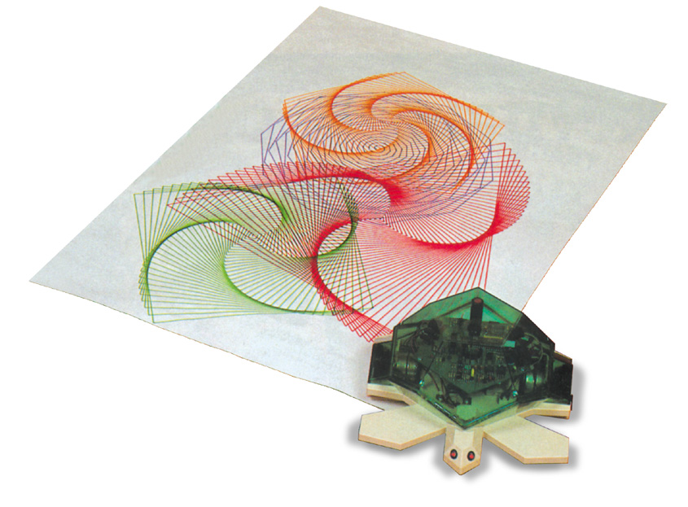
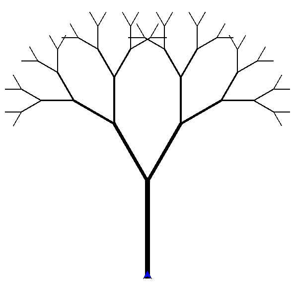

####################
The WorldTurtle tour
####################

*****************
What are Turtles?
*****************

Turtles are programmable cursors that when given a few simple commands can draw
cool, complex shapes! 

  We call our cursors "turtles" after the original, programmable robots!

  Attribution: Valiant Technology Ltd.

Turtle graphics lends themselves well to Haskell concepts like recursion and
monads. This series is a collection of tutorials for the beginner to learn
Haskell using the WorldTurtle module.

  A tree drawn recursively using turtle graphics.

****************************************
Why should I learn Haskell with turtles?
****************************************

If you are struggling with certain Haskell concepts, then hopefully seeing how
they play out visually will help you understand the processes involved.

**********
Off we go!
**********

Let's :ref:`build a new project<Creating a new WorldTurtle project>` called
:code:`my-first-turtle`!

.. note::
  
  To create a new project called "my-first-turtle" with Stack type the 
  following in the command line!

  .. code-block:: bash

    stack new my-first-turtle FortOyer/worldturtle

Inside :code:`my-first-turtle/src/Main.hs` is the code for your new WorldTurtle
application.

.. code-block:: haskell

  module Main where

  import Graphics.WorldTurtle

  main :: IO ()
  main = runTurtle $ do
    t <- makeTurtle
    forward 90 t

